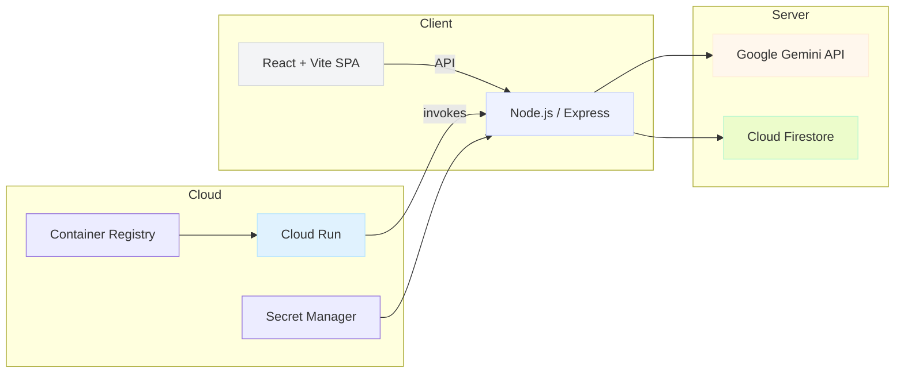

# EcoTracker

[](https://github.com/ShreyashChaugule-github/EcoTracker/actions)
[](https://hub.docker.com/)
[](https://nodejs.org/)
[](https://opensource.org/licenses/MIT)

Krótki przewodnik po projekcie EcoTracker — aplikacji full-stack do śledzenia i redukcji śladu węglowego użytkownika. Ten dokument jest przygotowany dla senior developerów: zawiera diagramy architektury, schematy przepływu technologii, instrukcje uruchomienia, wytyczne bezpieczeństwa i checklistę testów oraz dostępności.

## Spis treści
- **Przegląd**
- **Diagram architektury**
- **Tech stack — flow-chart**
- **Uruchomienie lokalne**
- **Budowanie i wdrożenie (Cloud Run)**
- **Bezpieczeństwo**
- **Testowanie**
- **Dostępność**
- **Szybkie wskazówki dla przeglądu kodu**

---

## Przegląd
EcoTracker to SPA zfrontendowane w React (Vite) i backendem Express (Node.js). Serwer jest bundlowany przez `esbuild` do `dist/server.cjs`. Producent pliku budowy polega na `esbuild` do bundlowania serwera oraz na `vite build` do frontendu. Aplikacja korzysta z Firestore (Firebase) jako źródła prawdy oraz z Google Gemini (`@google/genai`) dla funkcji AI.

Projekt jest przygotowany do uruchomienia w Cloud Run (konteneryzacja Docker). W repo znajduje się wielostopniowy `Dockerfile` optymalizujący rozmiar obrazu runtime.

## Diagram architektury



Opis: klient (SPA) komunikuje się przez REST API z serwerem Express, który agreguje dane z Firestore i wywołuje Google Gemini. Aplikację wdrażamy jako kontener na Cloud Run, obraz przechowywany w Container Registry. Sekrety (API keys, firebase config) przechowujemy w Secret Manager i podajemy do Cloud Run jako zmienne środowiskowe lub mount.

## Tech-stack — flow-chart

```mermaid
flowchart TD
  A[Developer] -->|dev server| B[Vite (frontend)]
  B --> C[React Components]
  A -->|server dev| D[tsx (dev runner)]
  D --> E[Express server]
  E --> F[esbuild bundle -> dist/server.cjs]
  E --> G[Firestore]
  E --> H[Google Gemini (@google/genai)]
  E --> I[adm-zip (download package)]
```

## Uruchomienie lokalne (dla senior dev)

1. Skopiuj repo i zainstaluj zależności:

```bash
git clone https://github.com/ShreyashChaugule-github/EcoTracker.git
cd EcoTracker
npm ci
```

2. Uruchom serwer development (Vite middleware + Express):

```bash
npm run dev
# Serwer uruchomi się na http://0.0.0.0:8080 lub http://localhost:8080
```

3. Budowanie produkcyjne (tworzy `dist/server.cjs`):

```bash
npm run build
```

4. Smoke test (skrypt uruchamia zbudowany serwer i testuje `/api/health`):

```bash
npm test
```

## Wdrożenie: Cloud Run (skrót)

- Projekt GCP: `ecotracker-499709` (używane w przykładach)
- Buduj i wypchnij obraz:

```bash
gcloud builds submit --tag gcr.io/ecotracker-499709/ecotracker --project=ecotracker-499709
```

- Wdrażanie do Cloud Run:

```bash
gcloud run deploy ecotracker \
  --image gcr.io/ecotracker-499709/ecotracker \
  --platform managed \
  --region us-central1 \
  --allow-unauthenticated \
  --project ecotracker-499709
```

## Sekrety i konfiguracja

- Nigdy nie commituj kluczy API ani `firebase-applet-config.json` do repo. Używaj Secret Manager.
- Przykład tworzenia sekretu:

```bash
echo -n "YOUR_GEMINI_KEY" | gcloud secrets create gemini-api-key --data-file=- --project=ecotracker-499709
```

- Podczas wdrożenia Cloud Run powiąż sekret jako zmienną środowiskową:

```bash
gcloud run deploy ecotracker --image gcr.io/ecotracker-499709/ecotracker \
  --set-secrets GEMINI_API_KEY=gemini-api-key:latest --region us-central1 --project=ecotracker-499709
```

## Bezpieczeństwo (zalecenia dla senior dev)

- W produkcji włącz CSP (`helmet`) z restrykcyjnymi dyrektywami.
- Upewnij się, że Cloud Run nie ujawnia nadmiernych uprawnień; używaj najniższych możliwych uprawnień dla serwis account.
- Weryfikuj i waliduj wszystkie wejścia (używamy `express-validator`).
- Ogranicz logowanie danych wrażliwych (maskuj/anonimizuj).

## Testowanie

- `npm test` uruchamia prosty smoke test: buduje i sprawdza `/api/health`.
- Dodaj testy integracyjne z `jest` + `supertest` dla kluczowych endpointów (`/api/profile/:userId`, `/api/carbon/logs`, `/api/health`).

Przykładowe test checklist:
- Unit: walidacja algorytmów obliczania CO2
- Integration: zapisy i odczyty do lokalnej `local_database.json` (fallback)
- E2E: symulacja użytkownika tworzącego log emisji i pobierającego statystyki

## Accessibility — checklista

- Każda interaktywna kontrolka powinna mieć `aria-*` atrybuty i opis (`title`/`aria-label`).
- Kontrast kolorów i skalowalność czcionek (WCAG AA).
- Formularze muszą mieć powiązane `label` i logiczną kolejność focus.
- Recharts: zapewnić alternatywny tekst lub tabele danych dla wykresów.

## Szybkie wskazówki przeglądowe (code-review focus)

- Szukaj miejsca wycieków pamięci i długich operacji blokujących w endpointach AI (timeouty dla wywołań zewnętrznych).
- Weryfikuj fallback do `local_database.json` — testuj scentralizowane przypadki offline.
- Upewnij się, że bundle serwera (`dist/server.cjs`) nie zawiera sekretnych stringów.
- Sprawdź reguły `firestore.rules` oraz `firebase-applet-config.example` przed produkcyjnym połączeniem.

---

Jeśli chcesz, przygotuję też:
- `cloudbuild.yaml` dla reproducible builds
- przykładowe testy `jest` + `supertest`
- `deploy.sh` automatyzujący push obrazu i deploy z Secret Manager

Daj znać, które z tych dodatkowych elementów mam dodać teraz.
<div align="center">

</div>

# Run and deploy your AI Studio app

This contains everything you need to run your app locally.

View your app in AI Studio: https://ai.studio/apps/283fd0dc-c7ee-47e7-9517-e64c8e2b0da7

## Run Locally

**Prerequisites:**  Node.js


1. Install dependencies:
   `npm install`
2. Set the `GEMINI_API_KEY` in [.env.local](.env.local) to your Gemini API key
3. Run the app:
   `npm run dev`
