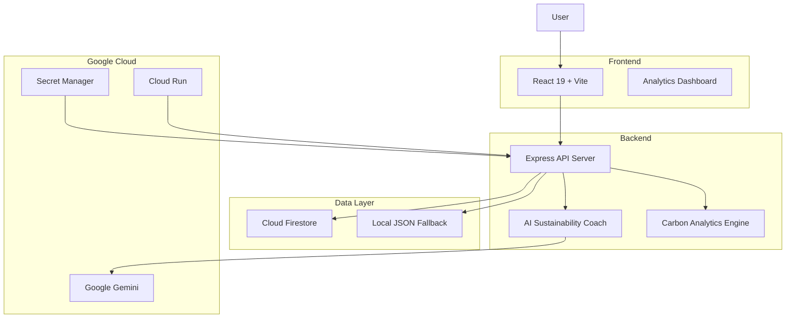
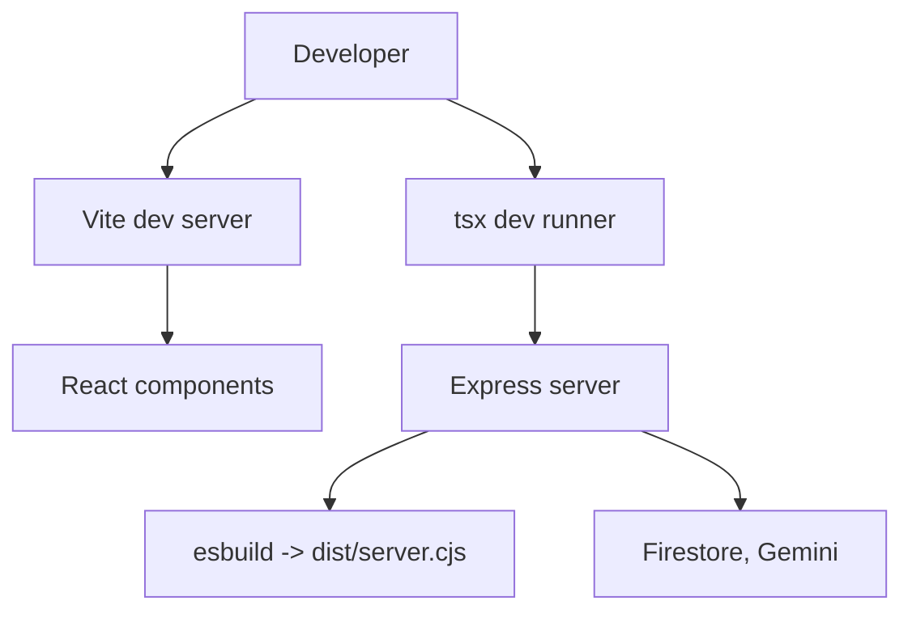

# EcoTracker 🌱

[](https://reactjs.org/)
[](https://nodejs.org/)
[](https://vitejs.dev/)
[](https://developers.google.com/)
[](https://firebase.google.com/)
[](https://www.docker.com/)

[](https://github.com/)

> EcoTracker is an AI-assisted personal carbon tracker that helps users record footprint entries, compute CO2 equivalents, track eco-actions, and get tailored coaching from an AI Carbon Coach.

## 📁 Project Summary

- **Purpose:** Track and visualize personal carbon emissions, recommend actions, and help users progress through gamified incentives.
- **Audience:** Individuals and power users interested in measuring and reducing personal emissions.
- **Structure:** React SPA (Vite) frontend + Node/Express backend bundled with `esbuild`. Firestore is the primary DB with a local JSON fallback for offline/dev use.

---

## 🚀 Key Features

- Record and categorize carbon logs (transport, food, electricity, waste, shopping, water)
- Convert inputs into CO2-equivalent values with domain heuristics
- AI Carbon Coach: interactive prompts and assessments via Google Gemini (`@google/genai`)
- Eco-actions, habit tracking, leaderboards, and offsets panel
- Dynamic export (ZIP) of project files (on-demand)

---

## 🧭 Approach & Logic

1. Guide-first UX: structured flows and dashboards to help users identify high-impact actions.
2. Backend proxy to Gemini: frontend never holds AI keys — server sanitizes prompts and calls Gemini.
3. Graceful fallback: when Firestore is unavailable the server uses `local_database.json` to keep functionality stable.

---

## ⚙️ How the Solution Works

1. User interacts with SPA (React) — adds logs, completes eco-actions.
2. SPA calls Express REST endpoints (`/api/*`) for reads/writes and AI interactions.
3. Server reads/writes Firestore or local fallback and calls Gemini for coaching endpoints.
4. In production the app is packaged into a Docker image and deployed to Cloud Run; secrets are stored in Secret Manager.

---

## 🗺️ Architecture (diagram)

## 🏗️ Architecture



---

## 🧩 Code Flow



---

## 🛠️ Tech Stack

- Frontend: React 19, Vite, Tailwind CSS, Recharts
- Backend: Node.js 18+, Express, esbuild
- AI: Google Gemini via `@google/genai`
- Database: Cloud Firestore (with `local_database.json` fallback)
- Dev: TypeScript, tsx, npm
- Deployment: Docker (Cloud Run recommended)

---

## 🧭 Quickstart — Local Development

Prerequisites: Node.js >=18, npm

```bash
git clone https://github.com/ShreyashChaugule-github/EcoTracker.git
cd EcoTracker
npm ci
```

Run dev server (Vite + Express):

```bash
npm run dev
# Open http://localhost:8080
```

Build for production:

```bash
npm run build
```

Smoke test (built server healthcheck):

```bash
npm test
```

---

## 📦 Build & Deploy (Cloud Run)

Build & push with Cloud Build:

```bash
gcloud builds submit --tag gcr.io/ecotracker-499709/ecotracker --project=ecotracker-499709
```

Deploy to Cloud Run:

```bash
gcloud run deploy ecotracker \
  --image gcr.io/ecotracker-499709/ecotracker \
  --platform managed \
  --region us-central1 \
  --allow-unauthenticated \
  --project ecotracker-499709
```

Bind secrets (recommended):

```bash
echo -n "YOUR_GEMINI_KEY" | gcloud secrets create gemini-api-key --data-file=- --project=ecotracker-499709

gcloud run deploy ecotracker \
  --image gcr.io/ecotracker-499709/ecotracker \
  --set-secrets GEMINI_API_KEY=gemini-api-key:latest \
  --platform managed --region us-central1 --project ecotracker-499709
```

---

## ✅ Testing

- `npm test` — smoke test that builds and checks `/api/health`.
- Recommended: add `jest` + `supertest` for integration tests and `vitest` for frontend unit tests.

---

## 🔒 Security & Best Practices

- Keep API keys in Secret Manager; never commit secrets.
- Server-side only AI calls (proxy pattern) to prevent key leakage.
- Use `helmet` for CSP and `express-rate-limit` for AI endpoints.
- Validate inputs via `express-validator` and avoid verbose error leakage in prod.

---

## ♿ Accessibility

- Ensure interactive elements include `aria-*` labels and keyboard navigation.
- Provide textual or tabular equivalents for charts and visualizations.

---

## 📁 Files of Interest

- `server.ts` — Express server and API
- `src/` — React frontend components
- `Dockerfile` — multistage build
- `test/run-healthcheck.js` — smoke test
- `local_database.json` — local fallback DB (do not use in production)

---

Created with ❤️ for Prompt Wars Challenge 3.
